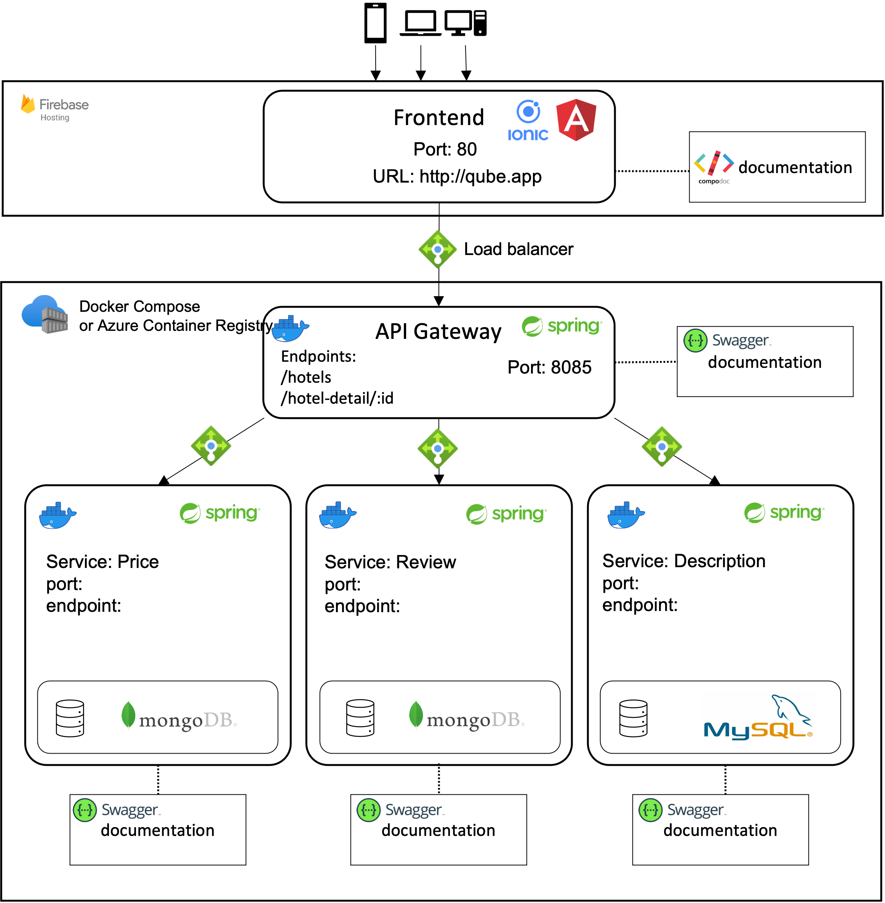

# Qub


## Rules
Example data
id: hotel1,hotel2,hotel3,hotel4,hotel5,...
cities: dublin, frankfurt, london

Services: Dockercompose finished. -> everything is setup and ready to fetch data
Gateway: Works

## About The Project

Our application is a hotel application like AirBnB or Booking.com. The user should be able to find hotels for a given timeframe, location and persons.

## Prerequisites
Docker

# Compiling and running code
1. Clone the repository. 
   ```sh
   git clone https://gitlab.com/ucd-cs-rem/comp30220-2023/qub.git
   ```
2. Inside the backend folder run ```mvn package```
3. Inside the project's root directory run ```docker compose up --build```
4. Frontend will be available at http://localhost:80

# Report
https://gitlab.com/ucd-cs-rem/comp30220-2023/qub/-/blob/main/System_Documentation.pdf
# Video
Available at: https://gitlab.com/ucd-cs-rem/comp30220-2023/qub/-/blob/main/Qube_final_video_final.mp4
